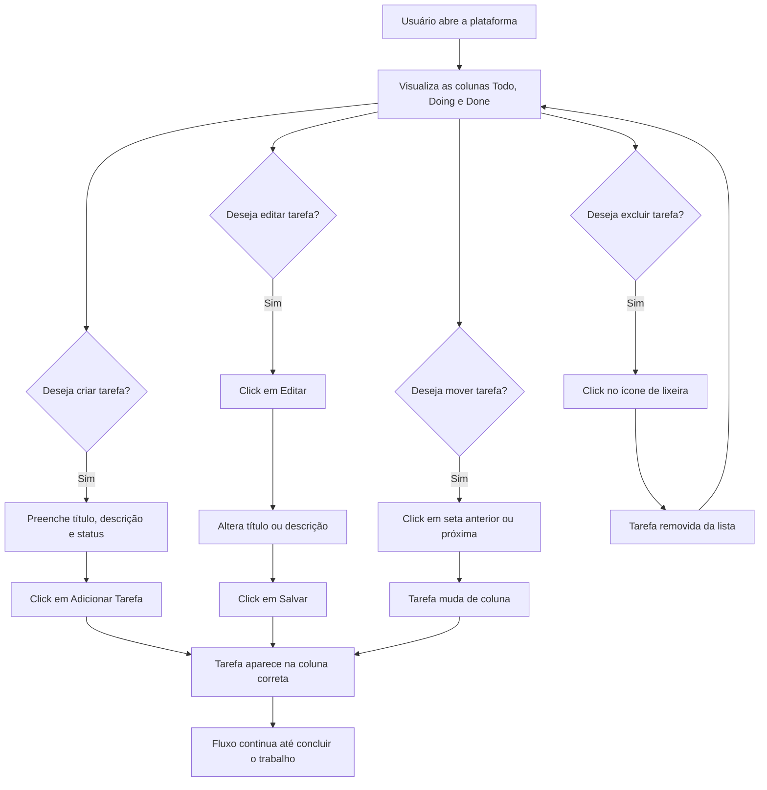

# Veritas Mini Kanban

Sistema de gestão de tarefas em estilo Kanban, com frontend em React + Vite e backend em Go.

## Visão geral

O projeto tem como objetivo organizar tarefas em colunas de fluxo de trabalho, permitindo ao usuário:

- criar novas tarefas
- visualizar tarefas por status
- editar o conteúdo da tarefa
- excluir tarefas
- mover tarefas entre colunas
- acompanhar o progresso no formato Kanban

A aplicação foi desenvolvida como uma plataforma web simples, funcional e responsiva, seguindo a proposta de usar Tailwind CSS em vez de estilos padrão.

## Stack tecnológica

- Frontend: React 18, Vite, Tailwind CSS
- Backend: Go 1.21
- Rotas HTTP: gorilla/mux
- CORS: rs/cors
- Comunicação com API: Axios

## Estrutura do projeto

```text
veritas-mini-kanban/
├── client/
│   ├── src/
│   ├── package.json
│   ├── vite.config.js
│   ├── tailwind.config.js
│   ├── postcss.config.js
│   └── index.html
├── server/
│   ├── main.go
│   ├── go.mod
│   └── kanban.exe
├── README.md
└── .gitignore
```

## Pré-requisitos

Antes de executar o projeto, confirme que você possui:

- Node.js 18 ou superior
- npm
- Go 1.21 ou superior

## Como executar

### 1) Backend

Na pasta `server`:

```bash
cd server
go run main.go
```

Se preferir usar o binário já compilado:

```bash
cd server
./kanban.exe
```

### 2) Frontend

Na pasta `client`:

```bash
cd client
npm install
npm run dev -- --host 0.0.0.0
```

Acesso local:

- Frontend: http://localhost:5173
- API: http://localhost:8080

## Funcionalidades implementadas

### Kanban por colunas

A aplicação organiza as tarefas em 3 status:

- Todo
- Doing
- Done

### CRUD completo

- criar tarefa
- listar tarefas
- atualizar tarefa
- excluir tarefa
- mudar status entre colunas

### interface e UX

- layout responsivo
- cards de tarefa com ações rápidas
- edição inline
- feedback de carregamento
- mensagens de erro
- estilo visual consistente com Tailwind

## API REST

A API do backend expõe os seguintes endpoints:

### GET /api/health

Retorna o estado do servidor.

Exemplo de resposta:

```json
{
  "status": "ok"
}
```

### GET /api/tasks

Retorna todas as tarefas cadastradas.

### POST /api/tasks

Cria uma nova tarefa.

Body:

```json
{
  "title": "Estudar React",
  "description": "Revisar componentes e hooks",
  "status": "todo"
}
```

### GET /api/tasks/{id}

Retorna uma tarefa específica.

### PUT /api/tasks/{id}

Atualiza uma tarefa existente.

Exemplo:

```json
{
  "title": "Atualizar README",
  "description": "Documentar fluxo e setup",
  "status": "doing"
}
```

### DELETE /api/tasks/{id}

Remove uma tarefa.

## User flow



### Fluxo principal do uso

1. O usuário acessa a plataforma e visualiza as colunas do Kanban.
2. Cria uma tarefa com título, descrição opcional e status inicial.
3. A tarefa aparece na coluna correta.
4. Pode editar o conteúdo diretamente na tarefa.
5. Pode mover a tarefa para o próximo ou anterior estágio do processo.
6. Pode excluir a tarefa quando ela não for mais necessária.
7. O processo continua em ciclos de organização e acompanhamento.

## Arquitetura da solução

### Frontend

O frontend é responsável por:

- renderizar a interface Kanban
- capturar os dados do formulário
- consumir os endpoints da API
- atualizar a visualização após cada ação

### Backend

O backend é responsável por:

- expor endpoints REST
- armazenar tarefas em memória
- validar entrada básica
- responder com JSON

### Persistência

Atualmente, a aplicação usa armazenamento em memória no servidor. Isso é suficiente para ambiente de desenvolvimento, testes locais e demonstração.

## Observações importantes

- O projeto foi pensado para execução local.
- O CORS está configurado para permitir comunicação entre frontend e backend em localhost.
- O frontend usa proxy do Vite para evitar problemas de comunicação com a API.

## Próximos passos possíveis

- persistência em banco de dados
- autenticação de usuários
- drag-and-drop visual
- filtros por status ou prioridade
- deploy em ambiente web

## Licença

Este projeto foi desenvolvido para fins de estudos e demonstração local.
