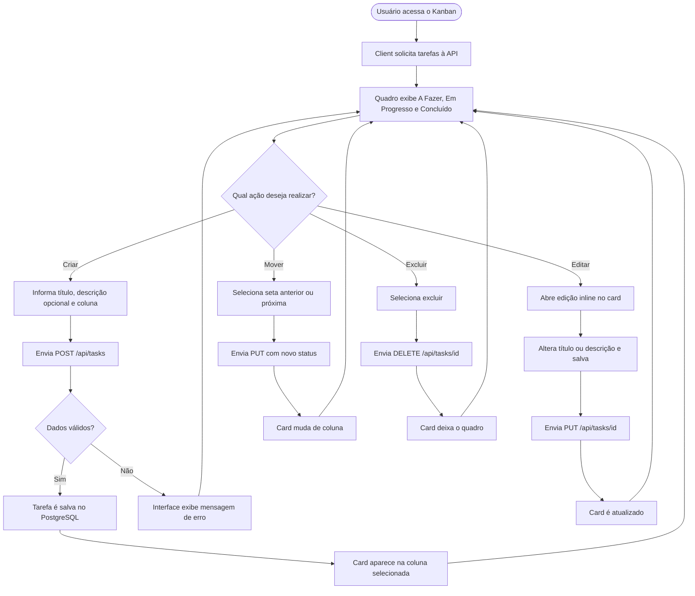

# User Flow — Veritas Mini Kanban

Este documento descreve o caminho principal de uso da aplicação. A interface foi pensada para que cada ação tenha uma consequência visual imediata e persista no PostgreSQL por meio da API.

## Regras do fluxo

- O título é obrigatório e aceita até 120 caracteres.
- A descrição é opcional.
- Os únicos status aceitos são `todo`, `doing` e `done`.
- A movimentação segue a ordem **A Fazer → Em Progresso → Concluído**.
- Os botões de movimentação foram escolhidos em vez de drag and drop para preservar previsibilidade em telas pequenas e uso por teclado.
- Após recarregar a página, o client busca novamente as tarefas persistidas no banco.
